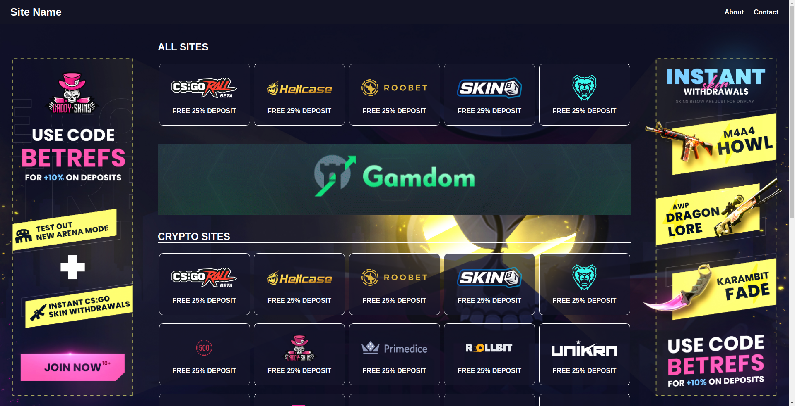

# CSGO-Ref-Site: Create your own referrals website


Why not have a site that displays all your referral codes? I created a fully responsive website for anyone to easily setup and use as their own referrals listing website. This website was created using HTML, CSS, and a little bit of javascript for the navigation bar. Inspiration and images are from https://betrefs.com/.


## Installation

Use [git](https://git-scm.com/) to install this website.

```bash
git clone git@github.com:yingersun/csgo-ref-site.git
```

## Features
* Fully responsive
* Collapsable navigation bar
* Ability to add advertisement banners
* Ability to change background image


## Preview

[Demo](https://yingersun.github.io/csgo-ref-site/)


## Contributing
Pull requests are welcome. For major changes, please open an issue first to discuss what you would like to change.

Please make sure to update tests as appropriate.

## License
[MIT](https://choosealicense.com/licenses/mit/)
